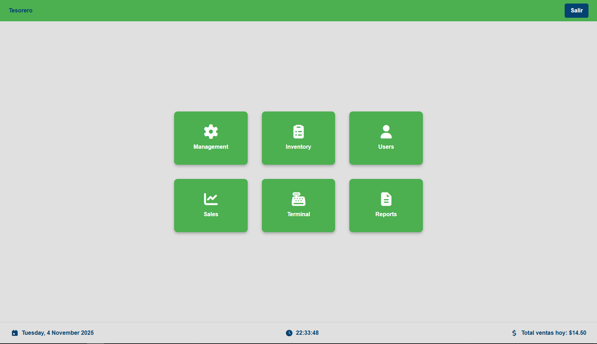

# 🏦 JuCoop — Sistema de Gestión para Cooperativas Estudiantiles

JuCoop es una aplicación web moderna desarrollada con **Laravel** y **Vue.js** que permite administrar de forma completa las operaciones de una **cooperativa estudiantil**.  
Desde la gestión de socios hasta el control de inventario, balances, transacciones y puntos de venta, todo en una sola plataforma web elegante, intuitiva y accesible.

---

## 🌐 Características principales

### 👥 Gestión de Socios
- Registro y administración de socios con información detallada.  
- Búsqueda rápida, filtrado y ordenamiento de usuarios.  
- Balance individual y número de socio asignado automáticamente.  

### 💰 Control Financiero
- Registro de **transacciones POS** con métodos de pago (efectivo, ATH Móvil, etc.).  
- Sección de **cuadre de caja** con desglose de billetes, monedas y depósitos.  
- Reportes automáticos de ganancias, ventas y compras.  

### 🛒 Inventario Inteligente
- Creación y edición de productos con nombre, precio, categoría y stock.  
- Actualización de stock en tiempo real desde el panel de administración.  
- Reportes de inventario en formato **Excel, PDF o CSV**.  

### 🧾 Reportes y Descargas
- Panel de descargas con informes operacionales, listas de clientes y reportes automáticos.  
- Selección de frecuencia y mes para cada informe.  

### 💻 Interfaz moderna y responsive
- Diseño profesional inspirado en sistemas administrativos como Discord o NCR Back Office.  
- Totalmente adaptable a **computadoras, tablets y móviles**.  
- Tema oscuro elegante para mejor legibilidad.  

---

## 🏗️ Tecnologías utilizadas

| Frontend | Backend | Base de datos | Realtime | Infraestructura |
|-----------|----------|---------------|-----------|------------------|
| Vue 3 | Laravel 9 | MySQL | Socket.IO / Redis | Docker, Nginx |

---

## ⚙️ Instalación y configuración

1. **Clona el repositorio:**
   ```bash
   git clone https://github.com/tuusuario/jucoop.git
   cd jucoop
   ```

2. **Instala las dependencias de Laravel:**
   ```bash
   composer install
   ```

3. **Instala las dependencias de Vue:**
   ```bash
   npm install
   ```

4. **Copia el archivo de entorno:**
   ```bash
   cp .env.example .env
   ```

5. **Configura tu base de datos y ejecuta las migraciones:**
   ```bash
   php artisan migrate --seed
   ```

6. **Ejecuta el servidor:**
   ```bash
   php artisan serve
   npm run dev
   ```

7. **Accede a la aplicación:**
   ```
   http://localhost:8000
   ```

---

## 📸 Vista previa



> *(Reemplaza la ruta por la imagen de tu proyecto, o usa un enlace directo desde GitHub o Imgur.)*

---

## 🧠 Desarrollador

**Angel Molina**  
Full Stack Developer — Laravel & Vue.js  
📧 [angelmolina02111@gmail.com](mailto:angelmolina02111@gmail.com)

---

## 📄 Licencia

Este proyecto está bajo la licencia **MIT**.  
Puedes usarlo, modificarlo y distribuirlo libremente con atribución al autor original.

---

## ⭐ Contribuye

Si te gusta el proyecto, ¡no olvides dejar una estrella en el repositorio!  
Cualquier sugerencia o mejora es bienvenida mediante *Pull Requests* o *Issues*.
